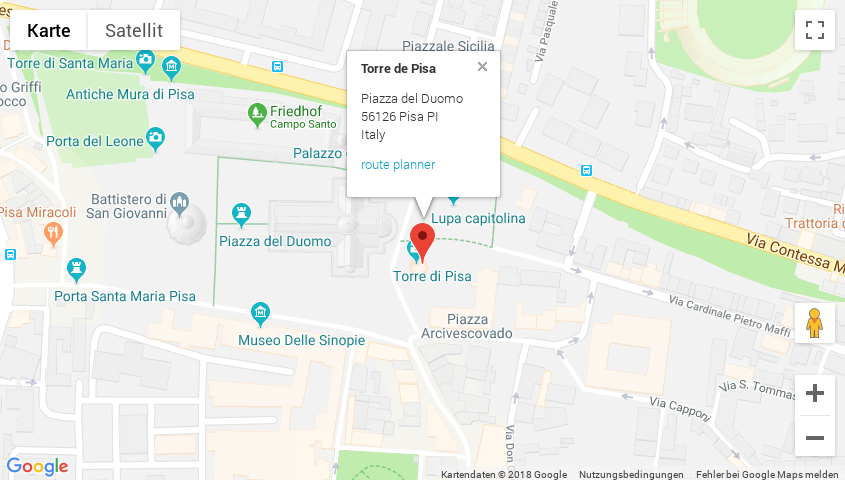

.. include:: ../Includes.txt

Introduction
============

What does it do?
----------------

This is a TYPO3 plugin that provides a simple map with marker and popup window.

The editor has a comfortable way of placing the position of the location with address search (geo coding). Additionally
the position (marker) can be moved by drag and drop.

Google Maps is used as map provider.

Screenshots
-----------

This is how the plugin output looks like.

    Well ... a map

The popup is open by default and shows a desription (rich text) and a link to
a route planner.