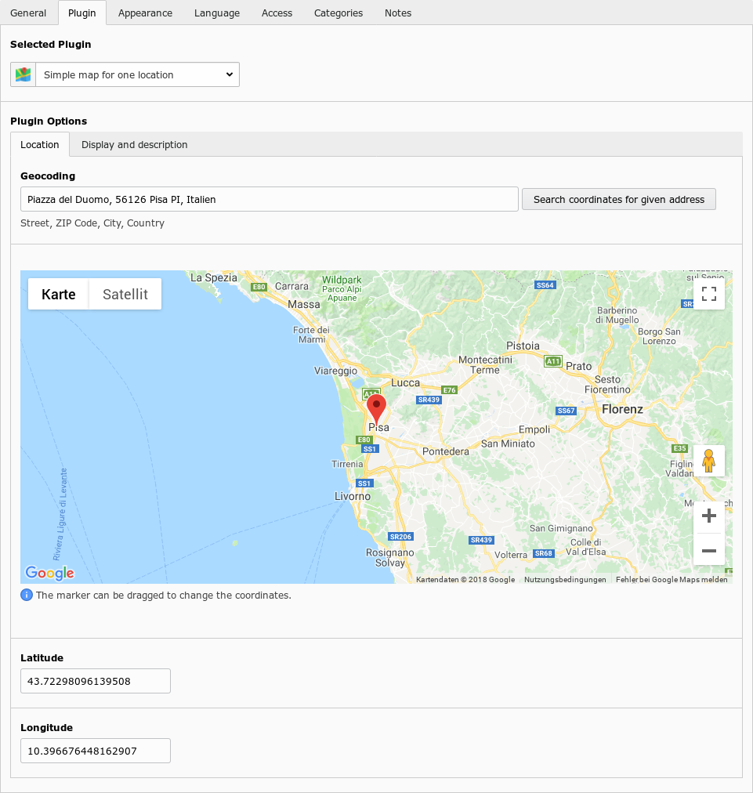
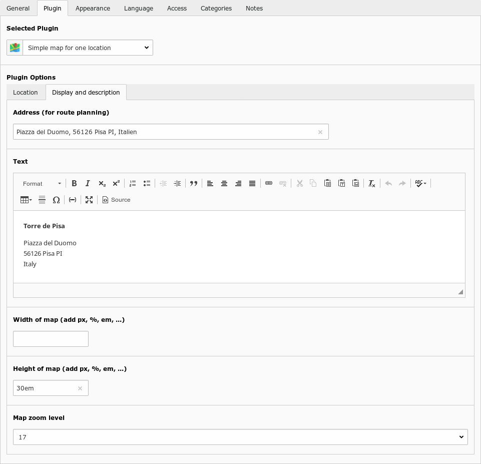
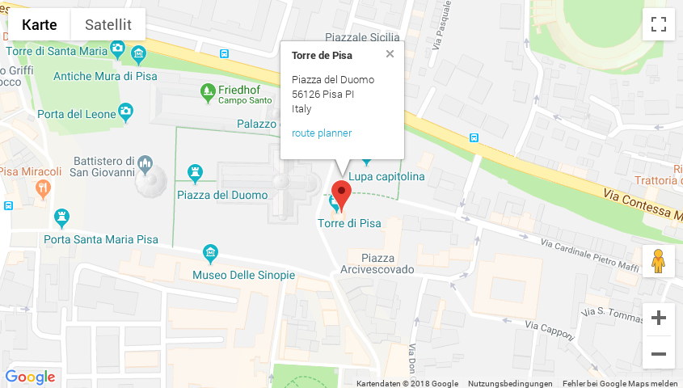

.. include:: ../Includes.txt

Users Manual
============

To include the map on your site, add a plugin content element and select **Simple map for one location** or create
one with the new element wizard.

Under **Plugin Option** you find two tabs:

Location
--------

Here you define the location that should be shown on the map.

    Location tab with comfortable location selection

The location is defined by the fields **Latitude** and **Longitude** which are geo coordinates.

You don't have to edit those fields by hand. There are two helper to get that coordinates for you:

1. Search coordinates for given address
^^^^^^^^^^^^^^^^^^^^^^^^^^^^^^^^^^^^^^^

Input an address in the **Geocoding** field and click on the search button. When the address can be located, the map
marker will be set to the coordinates. The coordinates field will be updated automatically.

2. Move map marker with mouse
^^^^^^^^^^^^^^^^^^^^^^^^^^^^^

You can drag the map marker around to define the wanted location. The coordinates field will be updated automatically.

Display and description
-----------------------

On this tab you define what will be displayed in the popup on the map. Additionally the map size and zoom level can be
set.

    Tab with data what to display on the map

The **Address** field will not be displayed but only used for the route planner link.

The **Text** field will be shown in the popup. You can put the name and address of the location here but also other or
additional information. Keep an eye on the amount of text, so it still fits on the map.

The **Width** and **Height** fields might be left empty so the default values from TypoScript are used. Please keep in
mind that the unit (px, %, em) is mandatory.

Screenshots
-----------

This is how the plugin output looks like. The popup is open by default and shows a desription (rich text) and a link to
a route planner.

    Well ... a map

